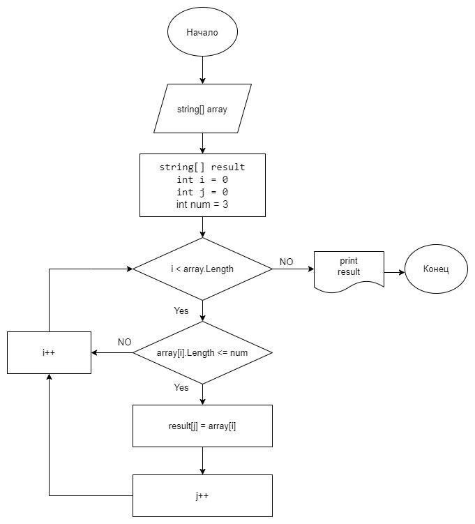

# Итоговая проверочная работа

### **_Задача:_**
Написать программу, которая из имеющегося массива строк формирует массив из строк, длина которых меньше либо равна 3 символа. Первоначальный массив можно ввести с клавиатуры, либо задать на старте выполнения алгоритма. При решении не рекомендуется пользоваться коллекциями, лучше обойтись исключительно массивами.
### **_Примеры:_**
[“Hello”, “2”, “world”, “:-)”] → [“2”, “:-)”]
[“1234”, “1567”, “-2”, “computer science”] → [“-2”]
[“Russia”, “Denmark”, “Kazan”] → []

### **_Описание алгоритма решения задачи:_**
1. Пользователь вводит строку из элементов массива, разделенных через пробел.
2. Преобразуем введенную строку в массив.
3. Проверяем каждый элемент массива на выполнение условия: **_длина каждого массива из строк меньше либо равна 3-м символам._**
4. Если условие выполняется, то кладем его в новый массив и увеличиваем счетчик. Если условие не выполняется, то просто увеличиваем счетчик.
5. После перебора массива получаем строку с подходящими по условию задачи элементами и выводим результат на печать.

### **_Программа:_**
Чтобы запустить программу перейдите в папку **_Program_** и запустите через терминал командой **_dotnet run_**, затем введите элементы массива через пробел.

### **_Блок-схема алгоритма:_**

